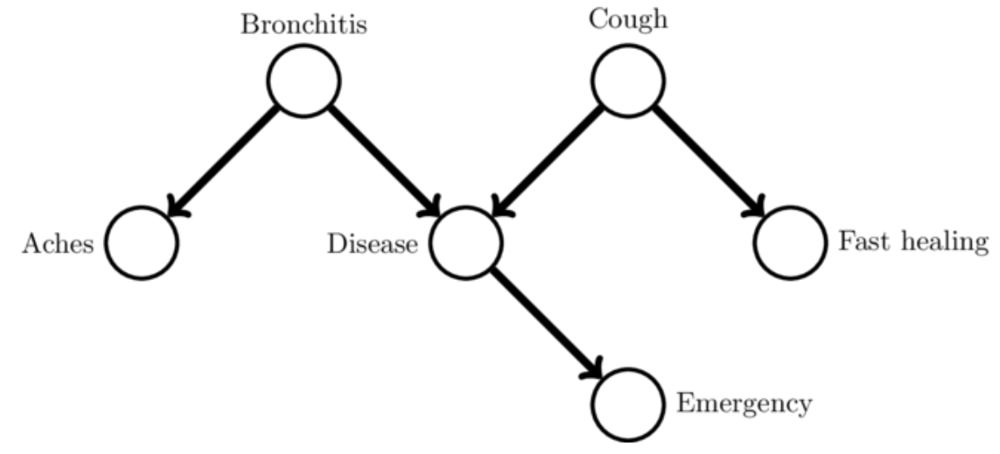

# DAGInference
Simple demo implementation of belief propagation for acyclic graphs using numpy.einsum.

The demo is for inference on the Bayesian network defined by:

For more information, see the accompanying [blog post](http://aslanides.github.io/machine_learning/2016/02/28/marginalization-einstein/).
